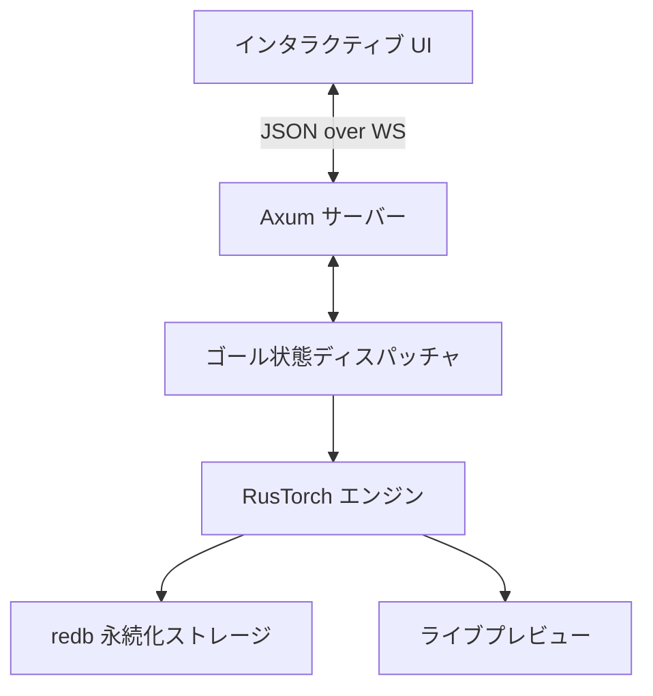

# Nebula Canvas: 思考の速度で描く、リアルタイム画像生成エンジン

**Nebula Canvas** は、思考の速度で画像を紡ぎ出す、次世代のリアルタイム・イメージ生成アプリケーションです。
Rust ネイティブの超高速演算エンジン **RusTorch** を核とし、「生成を待つ」という概念を過去のものにします。

## ✨ Nebula が提供する「魔法」の体験

Nebula は単なるツールではなく、あなたの創造性を拡張する「デジタル・キャンバス」です。

### 1. リアルタイム・キャンバス (Live Streaming)
プロンプトを一文字打つごとに、目の前の画像が瞬時に、鮮やかに変化します。変換を確定した瞬間に、あなたの想像は現実のピクセルへと昇華されます。

### 2. インテリジェント・ピラミッド UI (Pyramid UX)
- **表層 (Minimalist)**: 普段はプロンプトとスタイル選択のみ。究極のシンプルさが集中力を高めます。
- **深層 (Advanced)**: 必要に応じて「設定」を開けば、Seed値やステップ数といったプロの計器類が滑らかに展開。初心者からプロまで、迷うことはありません。

### 3. タイムライン・パラレル (Parallel History)
「さっきのほうが良かったかも」—— Nebula ではその迷いさえも資産です。
生成の全履歴は右側のタイムラインに自動保存。過去の画像をクリックするだけで、その時のプロンプトと設定が魔法のように復元されます。

## 🚀 圧倒的な技術的裏付け (Technical Supremacy)

Nebula の背後には、徹底的に研ぎ澄まされた Rust エンジニアリングが存在します。

| 評価項目 | 一般的な生成ツール (Python/PyTorch) | **Nebula (Rust/RusTorch)** |
| :--- | :--- | :--- |
| **推論エンジン** | PyTorch (巨大なランタイム) | **RusTorch (純Rust / 軽量)** |
| **通信プロトコル** | HTTP REST (高遅延) | **WebSockets (超低遅延)** |
| **タスク処理** | 逐次処理 / ブロッキング | **ゴール状態非同期ディスパッチャ** |
| **履歴管理** | JSONファイル / 一時的 | **redb (ACID準拠の永続化)** |

- **RusTorch 搭載**: 自社開発のテンソル演算ライブラリ RusTorch を搭載。Python のオーバーヘッドを排除し、ハードウェアの性能を極限まで引き出します。
- **非同期セーフ・アーキテクチャ**: 計算（推論）と通信（WebSockets）を完全に分離。IMEでの日本語入力中も、UIがフリーズすることはありません。
- **決定論的 ID (Blake3)**: 全ての生成物に一意のハッシュを付与。同じパラメータからは同じ ID が生成され、履歴の重複を許しません。

## 🏗️ システム構成図



## 🛠️ クイックスタート

### 1. バックエンドの起動
```bash
cd nebula-canvas/backend
cargo run --release
```

### 2. フロントエンドの起動
```bash
cd nebula-canvas/frontend
npm install
npm run dev
```

ブラウザで `http://localhost:3000` を開けば、そこはあなたの想像力が形になる Nebula Canvas です。

## 📜 関連ドキュメント
- **設計哲学**: [DESIGN_PHILOSOPHY.md](./DESIGN_PHILOSOPHY.md)
- **API仕様書**: [API_SPEC.md](./API_SPEC.md)
- **開発ガイド**: [DEVELOPMENT.md](./DEVELOPMENT.md)

---
**Nebula Canvas** - *Imagine at the speed of thought.*
